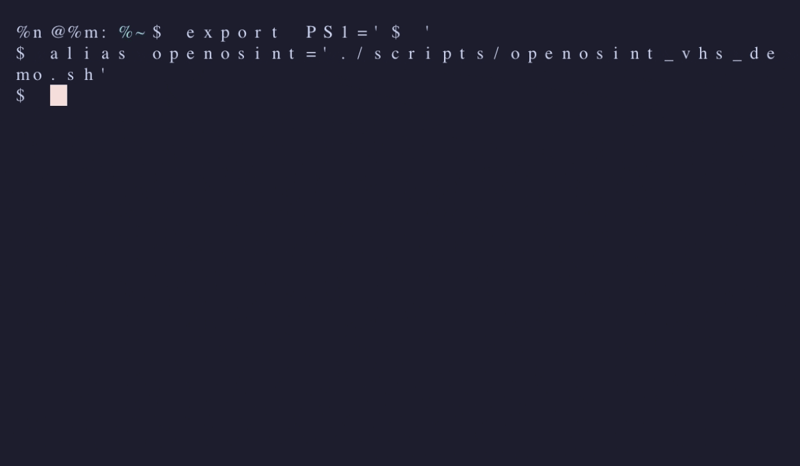

# OPENOSINT(1) &mdash; General Commands Manual

<div align="center">
  
</div>

<br>

[](https://github.com/OpenOSINT/OpenOSINT/releases)
[](https://www.python.org/)
[](https://modelcontextprotocol.io/)
[](https://pypi.org/project/openosint/)
[](LICENSE)

> ⚠️ **Legal Disclaimer**: OpenOSINT is intended for **legal and authorized use only**.
> Users are solely responsible for ensuring their use complies with all applicable laws.
> The authors accept no liability for misuse. See [DISCLAIMER.md](DISCLAIMER.md).

<div align="center">
  
</div>

---

## NAME

**openosint** &mdash; AI-powered OSINT agent, MCP server, and CLI for Open Source Intelligence.

---

## SYNOPSIS

```
openosint                                  # interactive AI REPL (default)
openosint shell                            # same as above
openosint email ADDRESS [-t N]             # direct email scan, no AI
openosint username HANDLE [-t N]           # direct username scan, no AI
openosint shodan QUERY [-t N]              # Shodan lookup, no AI
openosint virustotal TARGET [-t N]         # VirusTotal lookup, no AI
openosint censys TARGET [-t N]             # Censys lookup, no AI
openosint multi TARGETS                    # multi-target parallel investigation
openosint --parallel email ADDRESS         # parallel: search_email + search_breach
openosint --parallel username HANDLE       # parallel: search_username + search_paste
openosint --json email ADDRESS             # JSON output
openosint --provider ollama                # use local Ollama instead of Anthropic
openosint [-v] [--api-key KEY]
```

---

## DESCRIPTION

**openosint** is a modular OSINT framework with three interfaces:

**Interactive REPL** (default) — a Claude Code-style terminal where you type targets or questions in natural language. The AI agent decides which tools to run, chains them intelligently based on findings, and compiles a structured report.

**Direct CLI** — run individual OSINT tools without AI for scripting or quick lookups.

**MCP Server** — expose all 12 tools to any MCP-compatible AI client (Claude Code, Claude Desktop).

The framework is built on Python `asyncio`. All external binaries run as managed subprocesses with hard timeout enforcement. The AI layer uses the Anthropic native tool use API — or a local [Ollama](https://ollama.com) model (no API key required). When using Anthropic, the model issues hard stops when it needs a tool, your code executes it, the real output goes back. Hallucination in tool results is structurally impossible.

---

## ⭐ Support the Project

If OpenOSINT is useful to you, please consider starring the repository.
Stars help the project grow and reach more developers.

[](https://github.com/OpenOSINT/OpenOSINT/stargazers)

---

## ARCHITECTURE

| Layer | Path | Responsibility |
|-------|------|----------------|
| Core tools | `openosint/tools/` | Async wrappers around external OSINT binaries and APIs. Stateless. |
| AI agent | `openosint/agent.py` | Anthropic tool use loop. Maintains conversation history. |
| REPL | `openosint/repl.py` | Interactive terminal session. prompt_toolkit + Rich. |
| MCP server | `openosint/mcp_server.py` | MCP tool schema exposure for AI clients. |
| CLI | `openosint/cli.py` | Entry point. Launches REPL or direct commands. |

No layer imports from a layer above it.

---

## INSTALLATION

Requires Python 3.10 or later.

```bash
git clone https://github.com/OpenOSINT/OpenOSINT.git
cd OpenOSINT
pip install -e .
```

Set your Anthropic API key (not required when using Ollama):

```bash
export ANTHROPIC_API_KEY=sk-ant-...
```

**Optional: use a local Ollama model instead of Anthropic:**

```bash
# Install Ollama from https://ollama.com, then:
ollama pull llama3.2
pip install ollama
openosint --provider ollama
```

**External dependencies** (must be present in `PATH`):

| Binary | Purpose | Install |
|--------|---------|---------|
| `holehe` | Email account enumeration | `pip install holehe` |
| `sherlock` | Username enumeration (300+ platforms) | `pip install sherlock-project` |
| `sublist3r` | Subdomain enumeration | `pip install sublist3r` |
| `phoneinfoga` | Phone number intelligence | [Download binary](https://github.com/sundowndev/phoneinfoga/releases) |

If a binary is absent, the corresponding tool returns a descriptive error string. All other tools remain operational.

**Optional environment variables:**

| Variable | Tool | Purpose |
|----------|------|---------|
| `HIBP_API_KEY` | `search_breach` | HaveIBeenPwned API key — [get one here](https://haveibeenpwned.com/API/Key) |
| `IPINFO_TOKEN` | `search_ip` | ipinfo.io token for higher rate limits |
| `SHODAN_API_KEY` | `search_shodan` | Shodan API key — [get one here](https://account.shodan.io) |
| `VIRUSTOTAL_API_KEY` | `search_virustotal` | VirusTotal API key — [get one here](https://www.virustotal.com/gui/my-apikey) |
| `CENSYS_API_ID` | `search_censys` | Censys API ID — [get one here](https://censys.io/account) |
| `CENSYS_SECRET` | `search_censys` | Censys API Secret — [get one here](https://censys.io/account) |

**Optional Python packages:**

| Package | Purpose | Install |
|---------|---------|---------|
| `ollama` | Local LLM backend (no API key) | `pip install ollama` |
| `shodan` | Shodan API client | `pip install shodan` |
| `reportlab` | PDF report export | `pip install reportlab` |
| `censys` | Censys API client | `pip install censys` |

---

## INTERACTIVE REPL

Run `openosint` with no arguments to start the AI-powered REPL:

```
openosint ❯ investigate target@example.com

  → generate_dorks('target@example.com')
  → search_email('target@example.com')
  ✓ Found: Spotify, WordPress, Gravatar, Office365

  → search_breach('target@example.com')
  ✓ Found in 2 breaches: LinkedIn (2016), Adobe (2013)

  ╭──────────────────── Report ────────────────────╮
  │ ## Summary                                     │
  │ Single target identified — high confidence.    │
  │                                                │
  │ ## Online Presence                             │
  │ Spotify · WordPress · Gravatar · Office365     │
  │                                                │
  │ ## Data Breaches                               │
  │ LinkedIn (2016) · Adobe (2013)                 │
  │                                                │
  │ ## Conclusion                                  │
  │ Moderate footprint. Credential rotation        │
  │ advised given breach exposure.                 │
  ╰────────────────────────────────────────────────╯

  ✓ Report saved → reports/2026-05-11_14-32-11_report.md
```

**REPL commands:**

| Command | Description |
|---------|-------------|
| `<target>` | Investigate any target — email, username, domain, IP, name |
| `clear` | Reset conversation memory |
| `save` | Save last report to `reports/` |
| `tools` | List available tools and their status |
| `config` | Show current configuration |
| `help` | Show all commands |
| `exit` / Ctrl-D | Exit |

Reports are auto-saved after every investigation containing structured findings.

---

## TOOLS

| Tool | Method | What it finds |
|------|--------|---------------|
| `search_email` | holehe | Social accounts linked to an email |
| `search_username` | sherlock | Accounts across 300+ platforms |
| `search_breach` | HaveIBeenPwned API | Data breach exposure |
| `search_whois` | python-whois | Domain registrant info |
| `search_ip` | ipinfo.io | Geolocation, ASN, hostname |
| `search_domain` | sublist3r | Subdomain enumeration |
| `generate_dorks` | built-in | Google dork URL generation |
| `search_paste` | psbdmp.ws | Pastebin dump mentions |
| `search_phone` | phoneinfoga | Carrier, country, line type |
| `search_shodan` | Shodan API | Open ports, banners, CVEs |
| `search_virustotal` | VirusTotal API v3 | Malicious/clean verdict from 70+ engines |
| `search_censys` | Censys API | Open ports, services, certificate history |

### search_email

Enumerates online services linked to an email address using [holehe](https://github.com/megadose/holehe).

**MCP parameter:** `email` (string, required)

**CLI:**
```bash
$ openosint email target@example.com
$ openosint email target@example.com -t 60
```

**Output:**
```
OSINT results for 'target@example.com':
[+] Spotify        https://open.spotify.com/user/target
[+] WordPress      https://wordpress.com/target
[+] Gravatar       https://gravatar.com/target
[+] Office365      email used
```

---

### search_username

Searches for a username across 300+ platforms using [sherlock](https://github.com/sherlock-project/sherlock).

**MCP parameter:** `username` (string, required)

**CLI:**
```bash
$ openosint username johndoe99
$ openosint username johndoe99 -t 120
```

**Output:**
```
OSINT results for username 'johndoe99':
[+] GitHub         https://github.com/johndoe99
[+] Twitter        https://twitter.com/johndoe99
[+] Reddit         https://reddit.com/user/johndoe99
```

---

### search_breach

Checks data breach exposure via [HaveIBeenPwned v3 API](https://haveibeenpwned.com/API/v3). Requires `HIBP_API_KEY`.

**MCP parameter:** `email` (string, required)

**Output:**
```
Found in 2 breach(es) for 'target@example.com':
[+] LinkedIn (2016-05-05) — leaked: Email addresses, Passwords
[+] Adobe (2013-10-04) — leaked: Email addresses, Password hints
```

---

### search_whois

Retrieves WHOIS data for a domain using [python-whois](https://github.com/richardpenman/whois).

**MCP parameter:** `domain` (string, required)

**Output:**
```
WHOIS results for 'example.com':
[+] Registrar: ICANN
[+] Created: 1995-08-14
[+] Expires: 2024-08-13
[+] Name Servers: A.IANA-SERVERS.NET
```

---

### search_ip

Retrieves geolocation and ASN data via [ipinfo.io](https://ipinfo.io). Free tier: 50k/month.

**MCP parameter:** `ip` (string, required)

**Output:**
```
IP intelligence for '8.8.8.8':
[+] Hostname: dns.google
[+] Org: AS15169 Google LLC
[+] City: Mountain View, CA, US
```

---

### search_domain

Enumerates subdomains using [sublist3r](https://github.com/aboul3la/Sublist3r).

**MCP parameter:** `domain` (string, required)

**Output:**
```
Subdomains found for 'example.com':
[+] mail.example.com
[+] dev.example.com
[+] api.example.com
```

---

### generate_dorks

Generates 12 targeted Google dork URLs for any target. No network calls.

**MCP parameter:** `target` (string, required)

**Output:**
```
Google dork URLs for 'johndoe':
[+] "johndoe" site:linkedin.com
    https://www.google.com/search?q=%22johndoe%22+site%3Alinkedin.com
[+] "johndoe" leaked OR breach OR dump
    https://www.google.com/search?q=%22johndoe%22+leaked+OR+breach+OR+dump
```

---

### search_paste

Searches Pastebin dumps via [psbdmp.ws](https://psbdmp.ws).

**MCP parameter:** `query` (string, required)

**Output:**
```
Found in 3 paste(s) for 'target@example.com':
[+] https://pastebin.com/aB1cD2eF (2023-04-12)
[+] https://pastebin.com/xY3zA4bC (2022-11-08)
```

---

### search_phone

Gathers phone intelligence using [phoneinfoga](https://github.com/sundowndev/phoneinfoga). Use E.164 format.

**MCP parameter:** `phone` (string, required)

**Output:**
```
Phone intelligence for '+14155552671':
[+] Country: United States
[+] Carrier: AT&T
[+] Line type: Mobile
```

---

### search_shodan

Queries the [Shodan](https://shodan.io) API. If the query is an IPv4 address, performs a host lookup (open ports, org, vulnerabilities). Otherwise performs a keyword/banner search.

**MCP parameter:** `query` (string, required) — IP address or any Shodan search query

**CLI:**
```bash
$ openosint shodan 8.8.8.8
$ openosint shodan "apache port:80 country:DE"
$ openosint shodan 8.8.8.8 -t 30
```

**Output:**
```
Shodan host intelligence for '8.8.8.8':
[+] IP: 8.8.8.8
[+] Org: Google LLC
[+] Country: United States
[+] Open ports: 53, 443
```

Requires `SHODAN_API_KEY` environment variable.

---

### search_virustotal

Checks an IP address, domain, URL, or file hash against [VirusTotal](https://www.virustotal.com)'s 70+ antivirus engines using the VirusTotal API v3. Auto-detects the input type.

**MCP parameter:** `target` (string, required) — IPv4 address, domain, full URL, or file hash (MD5/SHA-1/SHA-256)

**CLI:**
```bash
$ openosint virustotal 8.8.8.8
$ openosint virustotal example.com
$ openosint virustotal https://example.com/path
$ openosint virustotal 44d88612fea8a8f36de82e1278abb02f  # MD5 hash
$ openosint virustotal 8.8.8.8 -t 30
```

**Output:**
```
[VirusTotal] Type: ip
[VirusTotal] Country: US
[VirusTotal] ASN: AS15169 Google LLC
[VirusTotal] Network: 8.8.8.0/24
[VirusTotal] Malicious: 0
[VirusTotal] Suspicious: 0
[VirusTotal] Harmless: 72
[VirusTotal] Undetected: 10
```

If any engine flags the target as malicious:
```
[VirusTotal] Malicious: 3
⚠️  FLAGGED AS MALICIOUS by 3 engines
```

Requires `VIRUSTOTAL_API_KEY` environment variable.

---

### search_censys

Queries the [Censys](https://censys.io) API for internet-facing infrastructure data. Auto-detects the input type: IPv4 address → host view (open ports, services, ASN, country); domain → certificate search (SANs, issuer, first/last seen).

**MCP parameter:** `target` (string, required) — IPv4 address or domain name

**CLI:**
```bash
$ openosint censys 8.8.8.8
$ openosint censys example.com
$ openosint censys 8.8.8.8 -t 30
```

**Output (IP):**
```
[Censys] Type: ip
[Censys] IP: 8.8.8.8
[Censys] Open Ports: 53, 443, 853
[Censys] Services: DNS, HTTPS, DNS-over-TLS
[Censys] ASN: AS15169 Google LLC
[Censys] Country: United States
[Censys] Last Updated: 2026-05-18
```

**Output (domain):**
```
[Censys] Type: domain
[Censys] Domain: example.com
[Censys] Certificates Found: 12
[Censys] Issuer: Let's Encrypt
[Censys] SANs: example.com, www.example.com, api.example.com
[Censys] First Seen: 2020-01-15
[Censys] Last Seen: 2026-05-10
```

Requires `CENSYS_API_ID` and `CENSYS_SECRET` environment variables.

---

## DIRECT CLI COMMANDS

```
email ADDRESS [-t SECONDS]
```
Enumerate services for *ADDRESS* via holehe. Default timeout: 120s.

```
username HANDLE [-t SECONDS]
```
Enumerate platforms for *HANDLE* via sherlock. Default timeout: 180s.

```
shodan QUERY [-t SECONDS]
```
Shodan host lookup (IP) or keyword search. Default timeout: 30s. Requires `SHODAN_API_KEY`.

```
virustotal TARGET [-t SECONDS]
```
Check an IPv4 address, domain, URL, or file hash (MD5/SHA-1/SHA-256) against VirusTotal. Auto-detects input type. Default timeout: 30s. Requires `VIRUSTOTAL_API_KEY`.

```
censys TARGET [-t SECONDS]
```
Censys host view for an IPv4 address (open ports, services, ASN) or certificate search for a domain (SANs, issuer, first/last seen). Default timeout: 30s. Requires `CENSYS_API_ID` and `CENSYS_SECRET`.

```
multi TARGETS
```
Investigate multiple targets in parallel. *TARGETS* is either a comma-separated list or a path to a file with one target per line. Maximum 10 targets. Each target gets its own report; a summary report is also generated.

**Flags:**

| Flag | Description |
|------|-------------|
| `-v, --verbose` | Enable debug logging to stderr. |
| `-t, --timeout N` | Override subprocess timeout (seconds). |
| `--api-key KEY` | Anthropic API key (overrides env var). |
| `--parallel` | Run independent complementary tools concurrently via `asyncio.gather()`. For `email`: runs `search_email` + `search_breach` in parallel. For `username`: runs `search_username` + `search_paste` in parallel. |
| `--json` | Output results as structured JSON instead of formatted text. |
| `--provider {anthropic,ollama}` | AI provider for the REPL (default: `anthropic`). |
| `--ollama-model MODEL` | Ollama model name (default: `llama3.2`). |
| `--ollama-host URL` | Ollama server URL (default: `http://localhost:11434`). |
| `--no-pdf` | Disable automatic PDF generation alongside Markdown reports. |

---

## DOCKER

```bash
# Build and run
docker compose up --build

# One-off command
docker compose run --rm openosint email target@example.com --json
```

Set `ANTHROPIC_API_KEY` (and optionally `HIBP_API_KEY`, `IPINFO_TOKEN`) in a `.env` file or export them in your shell before running `docker compose`.

Reports are persisted to `./reports/` via a volume mount.

---

## MCP SERVER CONFIGURATION

### Claude Code

```bash
claude mcp add openosint python /absolute/path/to/OpenOSINT/openosint/mcp_server.py
claude mcp list
```

### Claude Desktop

Add to `~/Library/Application Support/Claude/claude_desktop_config.json`:

```json
{
  "mcpServers": {
    "openosint": {
      "command": "python",
      "args": ["/absolute/path/to/OpenOSINT/openosint/mcp_server.py"]
    }
  }
}
```

---

## EXAMPLES

**Interactive REPL:**
```bash
$ openosint
openosint ❯ investigate target@example.com
openosint ❯ find all accounts for johndoe99
openosint ❯ what subdomains does example.com have?
openosint ❯ check if +14155552671 is a mobile number
```

**Direct CLI:**
```bash
$ openosint email target@example.com -t 60
$ openosint username johndoe99
$ openosint -v email target@example.com
```

**Agentic via Claude Code:**
```
$ claude
> Investigate target@example.com. Trace any username found
  across other platforms and compile a full report.
```

---

## FILES

| Path | Description |
|------|-------------|
| `openosint/agent.py` | AI agent loop (Anthropic + Ollama). |
| `openosint/repl.py` | Interactive REPL session. |
| `openosint/mcp_server.py` | MCP server entry point (stdio). |
| `openosint/cli.py` | CLI entry point. |
| `openosint/pdf_report.py` | PDF report generator (reportlab). |
| `openosint/multi_target.py` | Multi-target parallel investigation. |
| `openosint/tools/search_email.py` | Email enumeration. |
| `openosint/tools/search_username.py` | Username enumeration. |
| `openosint/tools/search_breach.py` | Data breach check. |
| `openosint/tools/search_whois.py` | WHOIS lookup. |
| `openosint/tools/search_ip.py` | IP intelligence. |
| `openosint/tools/search_domain.py` | Subdomain enumeration. |
| `openosint/tools/generate_dorks.py` | Google dork generator. |
| `openosint/tools/search_paste.py` | Pastebin search. |
| `openosint/tools/search_phone.py` | Phone intelligence. |
| `openosint/tools/search_shodan.py` | Shodan host/search lookup. |
| `openosint/tools/search_virustotal.py` | VirusTotal IP/domain/URL/hash lookup. |
| `openosint/tools/search_censys.py` | Censys IP host view and domain certificate search. |
| `openosint/tools/exceptions.py` | Shared exception hierarchy. |
| `pyproject.toml` | Build configuration (PEP 621). |
| `DISCLAIMER.md` | Legal notice and ethical use policy. |

---

## INTEGRATIONS

| Provider | Data | Status |
|---|---|---|
| Shodan | Network assets, open ports, CVEs | v2.4.0 |
| VirusTotal | Malware detection, 70+ engines | v2.7.0 |
| Censys | Open ports, services, certificate history | v2.9.0 |

---

## EXIT STATUS

| Code | Meaning |
|------|---------|
| 0 | Successful execution. |
| 1 | General error. |
| 130 | Terminated by SIGINT (Ctrl-C). |

---

## AUTHORS

Developed by Tommaso Bertocchi.

---

## LICENSE

MIT License. See [LICENSE](LICENSE).

---

*OpenOSINT 2.9.0 &mdash; May 18, 2026*
